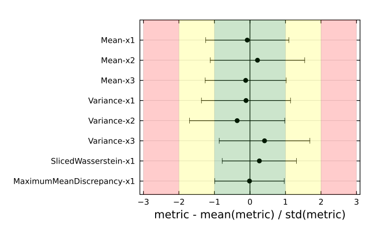
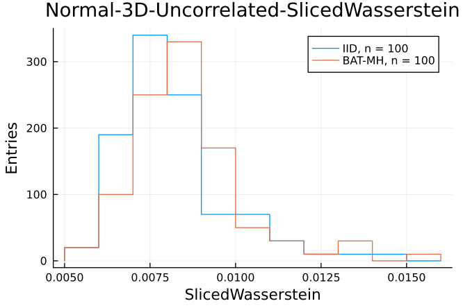

# MCBench: Monte Carlo Sampling Benchmark Suite

The **MCBench** benchmark suite is designed for quantitative comparisons of Monte Carlo (MC) samples. It offers a standardized method for evaluating MC sample quality and provides researchers and practitioners with a tool for validating, developing, and refining MC sampling algorithms. 

For benchmarking, different metrics are applied to point clouds of both independent and identically distributed (iid) samples and correlated samples generated by MC techniques, such as Markov Chain Monte Carlo or Nested Sampling. 
Through repeated comparisons, test statistics of the [metrics](#List-of-metrics) are gathered allowing to evaluate the quality of the MC samples. A variety of [target functions](#List-of-test-cases) with different complexities and dimensionalities are availble, providing a versatile platform for testing the capabilities of sampling algorithms. 

MCBench is implemented as Julia package but users can run external sampling algorithms of their choice on these test functions and input the resulting samples to obtain detailed metrics that quantify the quality of their samples compared to the iid samples generated by MCBench. 

## Installation
To use MCBench you need a [Julia installation](https://julialang.org/downloads/). We recommend to use Julia 1.10 or above.
Install MCBench via the Julia package manager by running
```
using Pkg
pkg"add https://github.com/tudo-physik-e4/MCBench"
```

## Workflow
1. Pick a test cases from the [list of available target functions](#List-of-test-cases). 
2. Implement these functions into the sampling software of your choice. We provide basic implementations of the listed test cases in Julia, Python (to be used with PyMC) and Stan.
3. Generate samples of the target functions with the algorithm you want to benchmark. Save the samples as a `.csv` file with `nparameters` columns and `nsamples` rows.
4. Use the Julia package `MCBench` to load your samples and benchmark them against IID samples (which are automatically generated by the package).
5. See [Using MCBench](Using-MCBench) for an example on how to use the `MCBench` package.


## Using MCBench
This is a simple example of how to use the MCBench package. 
#### Specify the test case
```
f = MvNormal(zeros(3), I(3))
bounds = NamedTupleDist(x = [-10..10 for i in 1:3])
Standard_Normal_3D_Uncorrelated = Testcases(f,bounds,3,"Normal-3D-Uncorrelated")
 ```
 
#### Selecting the metrics to be applied
```
metrics = [marginal_mean(), marginal_variance(), sliced_wasserstein_distance(), maximum_mean_discrepancy()]
 ```
 
#### Load the external MC samples to be tested
```
sampler = FileBasedSampler("samples_from_my_algorithm.csv")
```

#### Generating the teststatistics 
Evaluate the metrics both

- for the IID samples (IID samples are generated automatically in the background):
```
teststatistics_IID = build_teststatistic(Standard_Normal_3D_Uncorrelated, metrics,
n=100, n_steps=10^5, n_samples=10^5)
```
- and for the MC samples to be tested:
```
teststatistics_my_samples = build_teststatistic(Standard_Normal_3D_Uncorrelated, metrics,
n=100, n_steps=10^5, n_samples=10^5, s=sampler)
```
### Generating comparison plots
- Overview plot of all selected metrics
```
plot_metrics(Standard_Normal_3D_Uncorrelated, metrics, sampler)
```


- Individual metrics
```
plot_teststatistic(Standard_Normal_3D_Uncorrelated, marginal_mean(), sampler, nbins=20)
```


## List of test cases
The following table contains all test cases currently available in the benchmark suite.
When implementing one of these into the MC sampling framework of your choice, you can use the given testpoints to validate your implementation.  
We provide example implementations of the listed test cases to be used with Julia, Python, R and Stan.  
*This table is not yet complete and will be extended* 
| Name                            | Equation                                                                                                                                                                                                                   | Parameters                                | Testpoints                                                                                        | Julia | Python | R   | Stan |
| ------------------------------- | -------------------------------------------------------------------------------------------------------------------------------------------------------------------------------------------------------------------------- | ----------------------------------------- | ------------------------------------------------------------------------------------------------ | ----- | ------ | --- | ---- |
| Standard Normal 1D              | $f(x\|\mu, \sigma) =\frac{1}{\sqrt{2\pi\sigma^2}} e^{-\frac{(x - \mu)^2}{2\sigma^2}}$                                                                                                                                      | $\mu = 0, \sigma = 0$                     | $f(x=0) = 0.39894228$, $f(x=1) = 0.24197072$                                                     | ✅     |    ✅     |  ✅    |   ✅    |
| Standard Normal 2D Uncorrelated | $f(x\| \boldsymbol\mu, \boldsymbol\Sigma) = (2\pi)^{-k/2}\det (\boldsymbol\Sigma)^{-1/2} \exp \left( -\frac{1}{2} (\mathbf{x} - \boldsymbol\mu)^\mathrm{T} \boldsymbol\Sigma^{-1}(\mathbf{x} - \boldsymbol\mu) \right)$ | $k=2, \mu=\texttt{zeros(2)}, \Sigma= I_2$ | $f(x=[0, 0]) = 0.15915494$, $f(x=[0, 1]) = 0.096532352$, $f(x=[-1, 1]) = 0.0585498315$           | ✅     |   ✅      |  ✅    |   ✅    |
| Standard Normal 3D Uncorrelated | $f(x\| \boldsymbol\mu, \boldsymbol\Sigma) = (2\pi)^{-k/2}\det (\boldsymbol\Sigma)^{-1/2} \exp \left( -\frac{1}{2} (\mathbf{x} - \boldsymbol\mu)^\mathrm{T} \boldsymbol\Sigma^{-1}(\mathbf{x} - \boldsymbol\mu) \right)$ | $k=3, \mu=\texttt{zeros(3)}, \Sigma= I_3$ | $f(x=[0, 0, 0]) = 0.063493636$, $f(x=[1, 1, 1]) = 0.014167345$, $f(x=[-1, 0, 1]) = 0.0233580033$ | ✅     |  ✅       |  ✅    |   ✅    |


## List of metrics
The following metrics can be used to compare custom generated MC samples to IID samples.

### One-sample metrics
- Marginal mean: `marginal_mean()`
- Marginal variance: `marginal_variance()`
- Global mode: `global_mean()`
- Marginal mode: `marginal_mode()`
- Marginal skewness: `marginal_skewness()`
- Marginal kurtosis: `marginal_kurtosis()`

### Two-sample metric
- Chi-squared: `chi_squared()`
- Sliced Wasserstein Distance: `sliced_wasserstein_distance()`
- Maximum Mean Discrepancy: `maximum_mean_discrepancy()`


